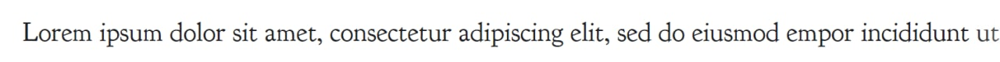
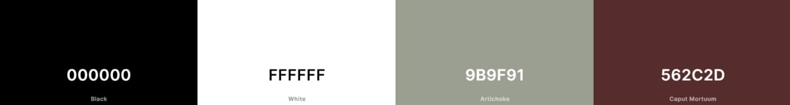

# Book Worm Quiz

 

 ## Purpose of the Project

 Main idea was to create an webpage with interactivity using HTML, CSS, JavaScript. For this reason I picked up a topic of books. Idea of quiz straightforward to check how familiar user are with the stories of the most popular books like Harry Potter, Lord of the rings, The Great Gatsby etc.

 My questions are created by myself and will be based on the rating of the most popular/famous books either classical or moerdn one. I  picked them up    [here](https://thegreatestbooks.org/) first 10 books from the list. Fortunately I read them as well as I am kind of Book Worm. Question would be easy and covered just main line and main story of the book so even if visitor read those books loooong time ago he/she would be able to answer them.

 User will choose  one answer from 3 available options that they believe is true. After the Quiz user can see the score of how well or bad they did, with time they took to finish the quiz. Once result presented user can decide to try it one more time or leave the page. 
 Link to [live site](https://bogdanfsd.github.io/Second-project/)

# **Contents**

* [**UX (User Experience)**](<#user-ecperience-ux>)
  * [**Vision**](<#vision>)
  * [**Aims**](<#aims>)
  * [**Audience**](<#audience>)
  * [**User Stories**](<#user-stories>)
* [**Design**](<#design>)
  * [**Fonts**](<#fonts>)
  * [**Colors**](<#colors>)
  * [**Images & Video**](<#images-video>)
* [**Features**](<#features>)
  * [**Future Features**](<#future-features>)
* [**Technologies**](<#technologies>)
  * [**Tools**](<#tools>)
  * [**Languages**](<#languages>)
  * [**Content**](<#content>)
* [**Testing**](<#testing>)
  * [**Code Validation**](<#code-validation>)
  * [**Responsive**](<#responsive>)
  * [**User Story Testing**](<#user-story-testing>)
  * [**Bugs Fixed**](<#bugs-fixed>)
  * [**Deployment**](<#deployment>)

## **UX (User Experience)**

### **Vision**

Book Worm Quiz this is easy quiz to check the knowledge of people who called themself bookworms. Quiz will ran through very famous books and will ask iser only the most famous and important parts of the story so there is no need to remember the color socks that Romeo wear while was climbind to Juliet. Although  this can give an idea if person want to re-read something again or if we are talkinf about bookworm-beginner so they can find just another good quality book to spent time with.

### **Aims**

Provide a small interactive game where reader test their memory at some great readings thet probably might read long time ago. Hope it will make some feeling when you just remember something very good that happened with you long time ago (memories from childhood etc) that pops up to your mind and you want to repeat that again. Should be easy and fun so people can re-play to upgrade their score and time about topic.

### **Audience**

Books are beyond any age and values that people might have in their mind so this quiz is for everybody who consider himself/herself as bookworm and want to test himself a bit.

[Back to menu](#contents)

### **User Stories**

- Visiting site for first time would like to find:
    - As a first time Visitor, I want to understand easly the main purpose of the game and the rules.
    - As a first time Visitor, I want quiz be relax and slightly challenging.
    - As a first time Visitor, I want to know my result once finished questions.
    - As a first time Visitor, I want to be able to re-play the quiz.
   

- Returning visitor to the site:
    - As a returning  Visitor, I want to play at any device
    - As a returning  Visitor, I want to see different question.
    - As a returning  Visitor, I want to see my previous score.

###  **Owner Goals**

- As owner I want user join the community.
- As owner I want user be able to contact our community through contact form.
- As owner I want to show that crypto is interestin, fun and lifechanging.

[Back to menu](#contents)

##  **Design**

###  **Fonts**

I stopped my choice at [Goudy Bookletter 1911](https://fonts.google.com/specimen/Goudy+Bookletter+1911?query=goudy) both for questions and answers as I really love oldschool typography and this font remind me that. As well it suits Book Worm Quiz perfectly as what could be better for bookworm than pleasent font. Please see an example:

[Back to menu](#contents)

###  **Colors**

This quiz all way long in a bit dark colors just what readers would like to have so nothing distract you (like very bright color). Each color complement each other. Black and White been first colors at my mind as we are readers seeing big part of our live in this colors. Artichoke reminds the color of the paper and Caput Mortuum just calm and relaxing color that match previous colors

[Back to menu](#contents)

### **Images & Video**

All images I too from [Unsplash](https://unsplash.com/). Found background of openned book and letters in the midle complement the quiz and each other. As well creates great atmosphere that you can have only with opened book in your hand.

### **Icon**

I will use icons from [Font Awesome](https://fontawesome.com/icons). I will use icon of the book near question (have no idea where yet)

### **Scope**

I found best approach for creating this quiz in waterfall. Which means that I would create each element and section and check them straight away to make sure that everything linked and work correctly before going to the next section. As long as User progress though the sections the one he completed will be hidden and new one displayed. I believe this approach will help me to finish project on time and tested everything.

### **Structure**

This is 2 page quiz. I found two pages the easiest for me to progress throught the development of the quiz. At index.html I was more focused on design of welcome page and location of the elements while game-rules.html have the same style but here I spend my time on developing the structure of HTML for quiz and logic. I want to make multipl number of divs that will pops up and hide while user progress clicking on the buttons.
